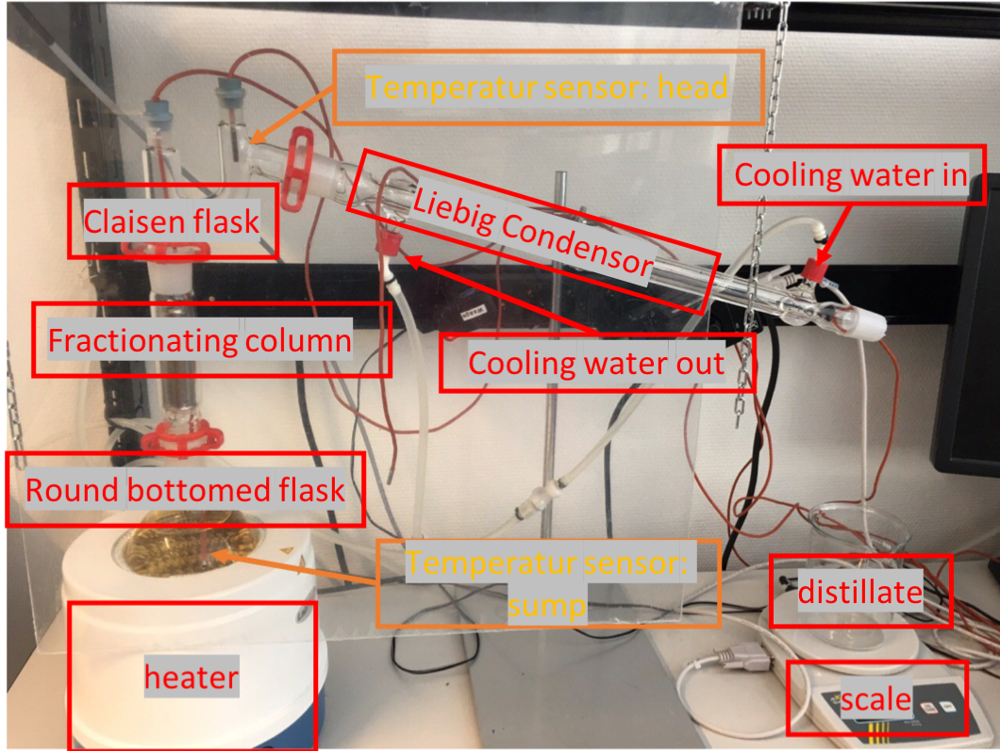
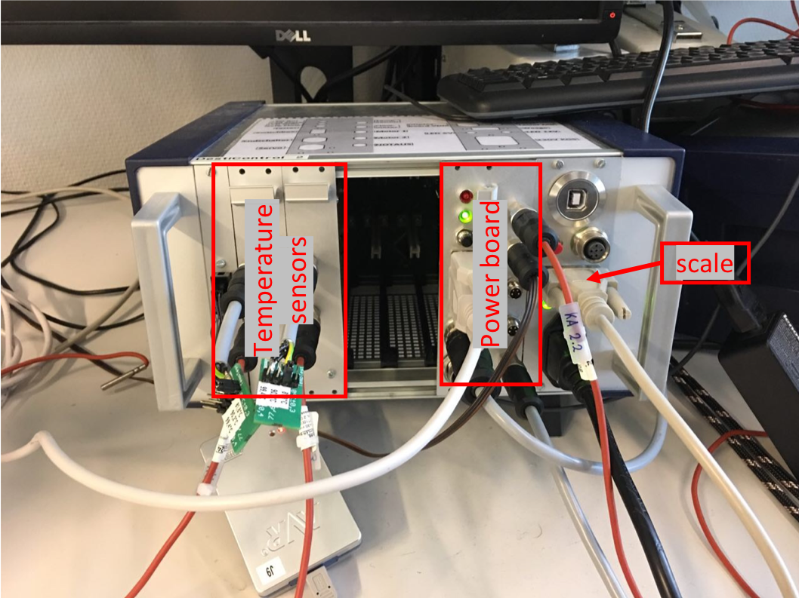

# Basics
## Distillation 

Distillation is the process of separating the components or substances from a liquid mixture by using selective boiling and condensation. In this course we used an ethanol-water mixture. Ethanol and water have different boiling temperatures. The boiling temperature of ethanol is 78°C and of water 100°C. Therefore, the distillation process is suitable to increase the ethanol content. 

The ethanol-water mixture is heated with a heater until one of the components boils. In our case that is ethanol. The vapor rises and passes into a condenser. We use a Liebig condenser. The condenser cools the vapor and changes it back into a liquid that is called distillate. 

The following picture shows the construction of a distillation plant:

@image latex distill.png 

## Automation

The challenge in this course was to automate the distillation process using a microcontroller. The microcontroller used is an ATMega 2560 and is located in a main board. 

On this main board there are also ports for serial communication and slots for peripheral boards. Two Temperature sensors and a power board were connected to the slots. One temperature sensor is used to measure the sump temperature and the other is used to measure the head temperature. 

The power board checks the security e.g. whether the safety windows are installed. In addition the switchable socket is controlled. The distillate is collected in a container located on a scale. Therefore a scale is also connected to the power board. 

The following picture shows the construction of the automation hardware: 

@image latex hardware.png 
