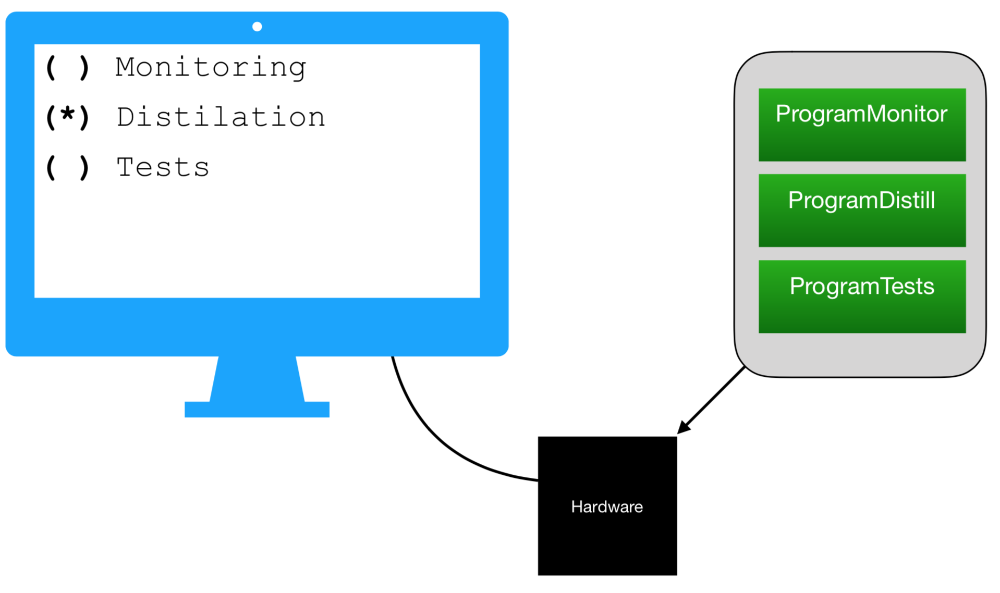
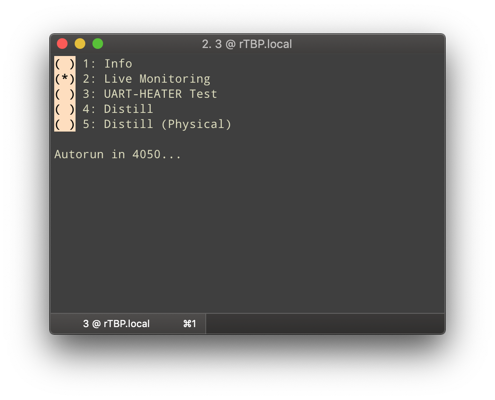
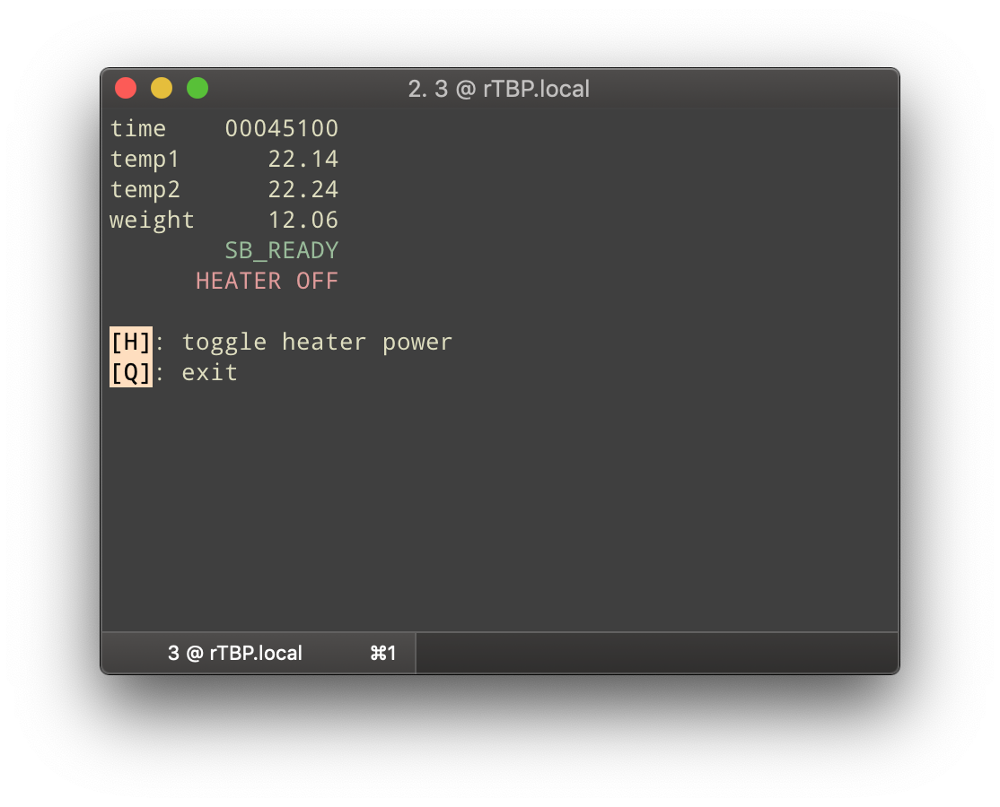
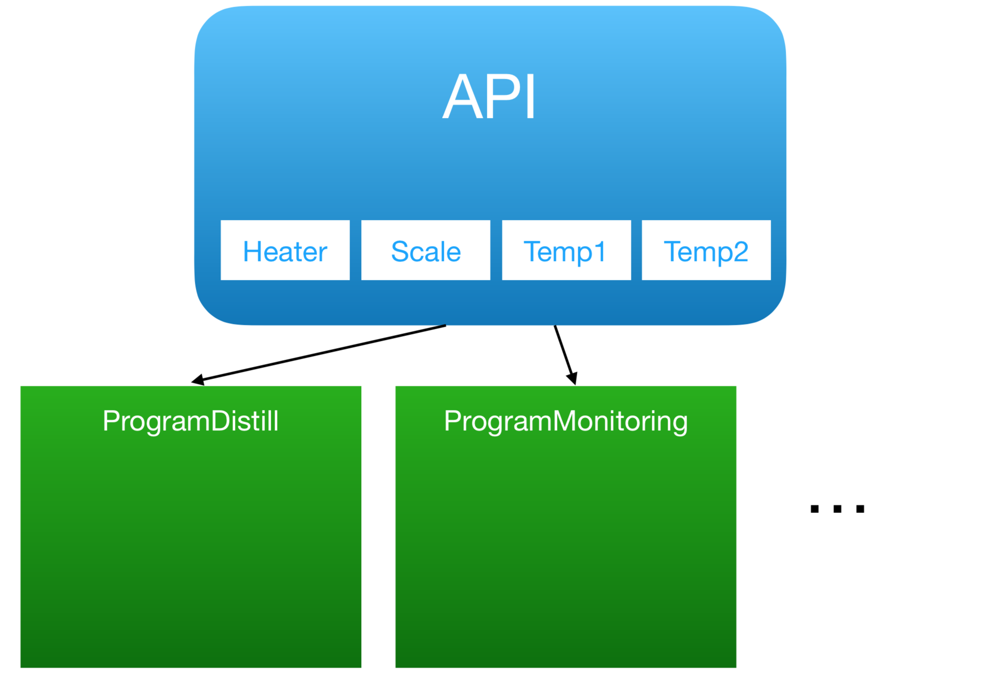

# Software Architecture

## Philosophy
Writing software for an embedded system with attached actuators comes with stricter safety requirements than usual general-purpose application code.
Our goal was to develop a high-quality product and not compromise stability or safety.
  
While programming C is fun, debugging C code on hardware can be painful.
In order to safe our sanity and time, we tried to keep the code clean and simple. This means for example reducing global state to a minimum, using functions that have as little side effects as possible, clear and consistent naming for all identifiers, a clear program flow with limited conditional branching and no dynamic memory allocation.

Lastly, pointers are useful, but also have big potential for errors. 
We limited their usage to where they are needed - so complex pointer arithmetic is not allowed, but function callbacks are permitted.

## Subprogram System
The main goal of the software ultimately is to produce liquor via destillation,
so it would be viable to just flash a software that runs a controller as soon as the hardware is powered on.

However, it is also desirable to be able to select a different software at runtime for many reasons:

- change distillation parameters to match small or large hardware setup 
- verify hardware peripherals
- run debug routines
- try out alternative controllers
- …

For these reasons, we have implemented a simple subprogram system.

@image latex subprogram-system.png

The subprogram system works by displaying all available programs to the user via a simple text interface based on the serial console.
Using the keyboard, the user can select the desired program, which will then run until completion and return to the main menu.

@image latex gui.png

@image latex live.png

It is easy to add a new program: We simple expand the array menu items by adding a [menu item](@ref menu_item) struct, consisting of a title string and a function callback.

Because only one program will ever run at a time, we do not need to worry about implementing a scheduler:
Each program launched is given exclusive access to the hardware until it finishes.

As a bonus, splitting up subroutines into multiple source files has allowed us to work on different programs at once, without the risk of merge conflicts.

Currently, the following subprograms are available:
- [Info](@ref program_info): Print basic usage information.
- [Live Monitoring](@ref program_live) - Constantly read all connected peripherals and allow user to toggle heater manually.
- [Scale Test](@ref program_scale_test) - Test scale
- [Heater Test](@ref program_uart_heater_test) - Test heater
- [Distill (Linear)](@ref program_linear_distill) - Automatic distillation, using the linear controller
- [Distill (Physical)](@ref program_distill_physical) - Automatic distillation, using the physically modeled controller

## API

All programs need access to the peripherals in one way or another.
While it is certainly possible to implement the hardware access again and again in each subprogram,
this leads to a lot of duplicate code (that would need to be updated in case of bug fixes or similar).

It is clear that this is not a viable approach to accessing the hardware.
From the very start of development, we have decided on a clear interface which offers hardware access by public methods.
The actual implementation details, like which bits need to get toggled to turn the heater off or on, are entirely hidden to the higher-level code that uses it, e.g. the various programs.

We call this encapsulation simply application programming interface (API).

@image latex api.png

The API encapsulates access to the following [hardware](@ref md_docs_03-hardware):
- [AD7792](@ref AD7792.h)
- [Scale](@ref scale.h)
- Heater

