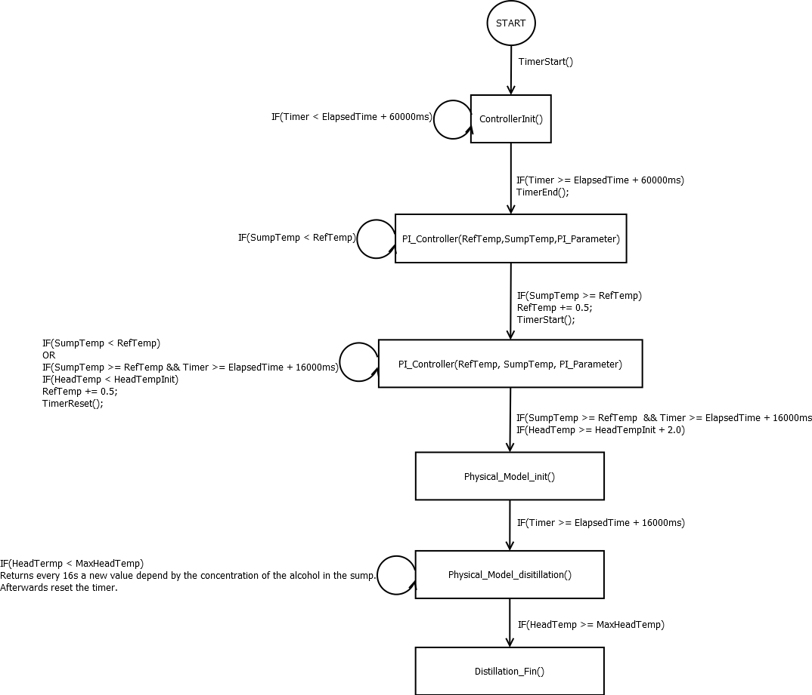

# Linear Controller

The linear controller assumes that there is a nearly constant outflow if constant power is applied.

We applied in three experiments 100 %, 50 % and 30 % power to 400 ml of wine in the small distillation  and linearised the outflow of each experiments. Then we linearised again the three different outflows and got the number n which determines how much more outflow there will be if we apply one percent more power. We calculated n = 0.048 (g/min)/% (see slides for more information).

After heating of the sump temperature by the PI controller, the required power is calculated by P = (g - n)/b, where g is the required outflow, n the aformentioned number and b, a constant offset (mainly power losses account for that offset).

After 0.3 g of distillate was produced, the controller begins to measure every minute how much actual outflow is produced. The power can then be adapted by dP = dg/n, where dg denotes the different between required and actual outflow.

To evalute the controller we executed two experiments with 1 g/min and 2.5 g/min required outflow. The graphes of outflow and power can be seen in the slides. In the first experiment (1 g/min) the controller produced 0.89 g/min, in the second one (2.5 g/min) 2.45 g/min where produced. Due to the fact that 2.5 g/min is regarding the ethanol concentration the more suitable outflow, the linear controller satisfied our requirements.

# Physically Based Controller
In addition to the linear controller model, there is an experimental physically based controller.  
What follows is both the theory as well as the implementation using a finite state machine (FSM).

## Physical Model

The physical model is an approach for controlling the nonlinear phase of distillation. Based on physical assumptions, the energy needed for a reference outflow is computed and in a second step used for control.

The total energy needed, called \f$E_{total}\f$, is composed of three components:

* The energy needed to maintain the first boiling temperature, called \f$E_{maint}\f$

* The energy needed to reach the current boiling temperature in difference to the first boiling temperature, called \f$E_{diff}\f$

* The energy needed to generate the reference outflow, called \f$E_{out}\f$

Those three components will be explained in the following. It must be added that everything is done in timesteps of 16s (the PWM duration), since this is the smallest control timestep. Furthermore, the time delays from swamp to head and from head to outflow are known.

### \f$E_{maint}\f$

The first boiling temperature will be reached PI-controlled. The controller’s output is percentage of the maximal heater power. Thus, the last controller output multiplied with the maximal heater power, which has been determined experimentally, is the power to maintain the first boiling temperature. From this,  with a timestep of 16s, \f$E_{maint}\f$ can be computed.

### \f$E_{diff}\f$

The energy needed to reach \f$\Delta T\f$, the temperature difference from the first boiling temperature to the current boiling temperature, can be computed according to

\f$E_{diff} = m*c_p*\Delta T\f$

For this, the current mass of the water/ethanol mixture is needed. In this model, this is done by storing the head temperatures to be able to compute the approximated alcohol concentration of the steam, linearly interpolating from the dew-boil curve. Knowing this concentration and assigning it to the corresponding outflow, the concentration of the product can be computed over time. Since the mass of the product is also known, the mass of ethanol and water in the product can be computed. In a last step, those masses can be subtracted from the known initial masses of ethanol and water in the educt, which can be computed from the known initial volume, initial concentration and the known densities of ethanol and water. Looking at the formula, furthermore the heat capacity of the water/ethanol mixture is needed. In this model, it is approximated according to the mass shares of ethanol and water, using the specific heat capacities of ethanol and water.

### \f$E_{out}\f$

To determine the energy needed to  generate the reference outflow,  literature vaporisation heats are used to approximate the unknown vaporisation heat of the ethanol/water mixture. Under the assumption that the vapor has the same alcohol concentration as the educt, this is again done, like for the approximation of heat capacity, according to the mass shares of ethanol and water. Using this vaporisation heat and the reference outflow, the energy \f$E_out\f$ can be computed.

Now \f$E_{total}\f$ is known and the corresponding PWM value can be calculated, using the timestep of 16s and the known maximal heater power.

## Control based on physical model#:

Having reached the boiling temperature, the energy computed according to the physical model is added to the system and an outflow is generated. After that, a known additional amount of energy is added to the system to generate an outflow difference. Now two input energies and the output flow they generated are known. From now on, the additional energy \f$E_{reg}\f$ needed to generate the outflow difference from the current outflow to the reference outflow can be linearly interpolated from the last two value pairs respectively. \f$E_{reg}\f$ is then added to \f$E_{total}\f$.

## Implementation using a FSM (Finite State Machine)

The FSM (Finite State Machine) is a simple mathematical model of computation. It is an abstract machine that can be in one of the finite number of state at given time.
For the distillation project a system with many phases should be implemented. It has been shown that the FSM is a clever soluton. 
The state and the condition for the transition to the next state is given in the following graph.

@image latex FSM_distillation_state.png

If the distillation programm starts it begins with the initial state. The first state calls ControllerInit. In this state controller do nothing for 60 seconds. 
This time was necessary because while the system identification the initial state of the system should be made known.

Afterwards follows the heating phase with PI Controller. 
To measure the real boiling temperature of wine the initial reference temperature is set as 92°C. A little bit lower than the value in the literature. 
The controller increase the reference value by 0.5°C if the initial reference is reached. Then the controller waits 16 seconds and measures the head temperature. 
If the current head temperature doesn't change with the initial head temperature controller increase the reference temperature by 0.5°C again.  
Else controller change the phase from heating to boiling. PI Controller will switched with a physical model based controller (PMC). More information about the physical model based controller can be found [here](Physical Model).
Distillation process is finished if the head temperature is over 92°C. Heater will turned off and the system gets the end state.
